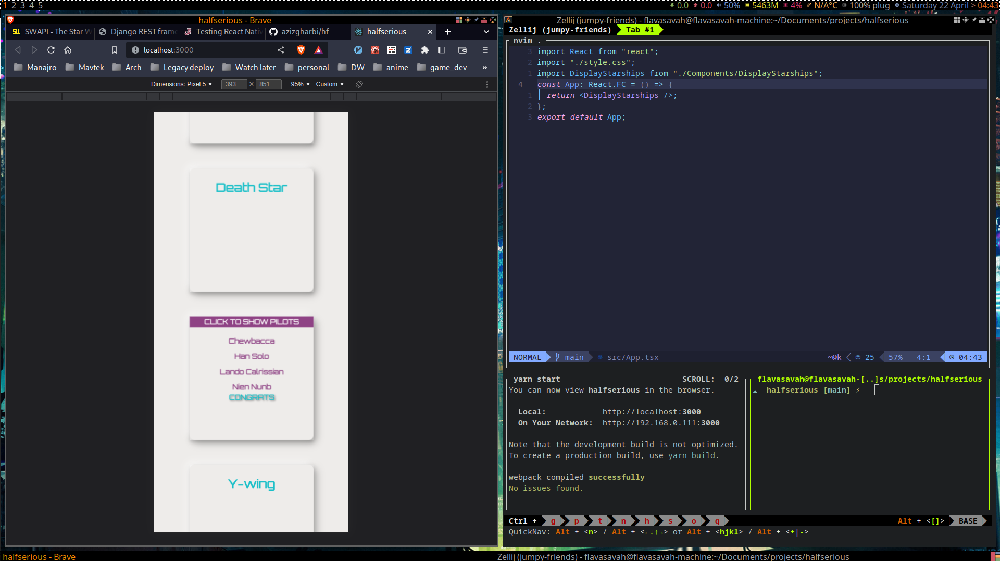

### Start the project:

- `yarn install`.
- `yarn start`.

- I am using `rome.js` for `linting` and `formatting`.
- `husky` for `pre-commit` `git hooks`.
#### nice to have:
- `Unit tests` `client-side tests`.
- `Centralized SCSS variables`.
- `Reducer, Context.api or other hooks: Basically, I don't see the reason.
- `CI/CD` on `github Workflow`.
#### demo

